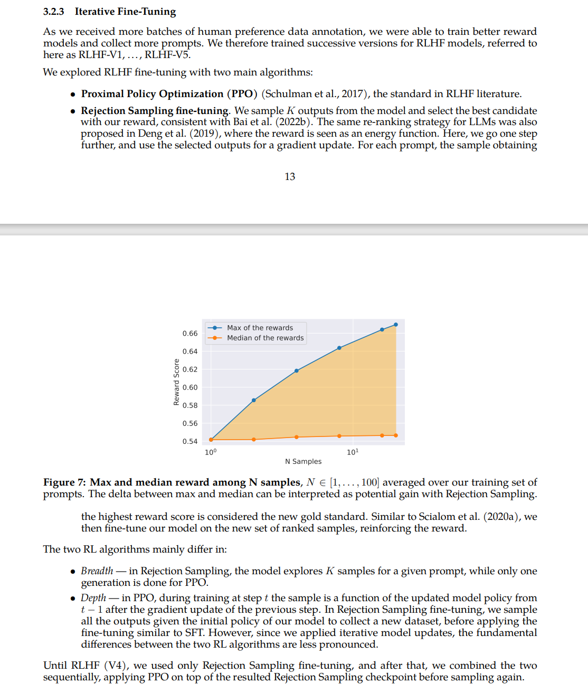

## Run RLHF on our tencent cloud server
The repo is rebased from https://github.com/lvwerra/trl/blob/main/examples/scripts/sentiment_tuning

But I pre-downloaded all model and datasets on our server to make it ready to run.

Also add some comments for easier understanding.

### Questions to think
1. What is the model of a facebook/opt-350m? THUDM/ChatGLM? 
Print them and show. 
2. What is the building block of an LLM? What is GLU block? What is attention? 
3. What are the SFT_Trainer, Reward_Trainer, PPO_Trainer working in details? Find out the loss functions. 
4. Visualize the training process with ***tensorboard***. In VSCode, open the command palette (Ctrl/Cmd + Shift + P) , search for the command “Python: Launch TensorBoard” and press enter. 

### Step 0: Task Understanding: generating positive movie reviews
Read the task at https://huggingface.co/lvwerra/gpt2-imdb-pos

### Step 1: Supervised fine-tuning on IMDB movie data
``python step_1_sft.py``

Check output at output/sft_1, will be used in step-3.


### Step 2: Reward modeling as sentimental classification of a movie review
``python step_2_reward.py``

Check output at output/rm_2, will be used in step-3.


### Step 3: RL encourages a model to generate only positive review 
First you can use online model to try this step, run
``python step_3_ppo_use_online_model.py``

Then, you can use model saved in Step-1 and Step-2 for RL fine-tuning.
 1. Modify ``step_3_ppo.py`` with your model checkpoint number, as

    ```
    model_name: Optional[str] = field(default="output/sft_1/checkpoint-10000", metadata={"help": "the model name"})
    
    ref_model_name: Optional[str] = field(default="output/rm_2/checkpoint-10000", metadata={"help": "the model name"})
    ```
    change the checkpoint-XXXXX with your model checkpoint number


 2. Run ``python step_3_ppo.py``


 3. The tensorboard should record learning stats.


       

      1) The reward is increasing as the model learns to generate positive reviews, i.e., positive scores, as shown in Figure above titled "env/reward_mean".
      2) The KL-div increases, as shown in Figure above "objective/kl".
      as the trained model and the fixed reference model (see code ref_model) gets more and more different with the training proceeds. Initially, model and ref_model are the same. 


      

      3) Question: what are the policy and loss in Figure above ?
      4) Question: what is advantage in Figure above "ppo/policy/advantage_mean" ?


### Step 4: Reject sampling inspired by LLAMA-2
This is a naive implementation inspired by LLAMA-2 [[paper]](https://arxiv.org/pdf/2307.09288.pdf).
It uses a reference model for generating K samples, then uses a reward model to score each sample.
It selects the top score sample for training the real model.  See the description in paper.

    

   To run this code
   1. update your trl/trainer/sft_trainer.py with https://github.com/fanchenyou/trl-exp/blob/main/trl/trainer/sft_trainer.py
   
   2. Download step_4_reject_sampling.py

   3. Run ``python step_4_reject_sampling.py``, which is slow due to inefficient implementation.

   4. Use ``tensorboard --logdir ./output/rs_4`` to visualize result.

#### TIPS: 
   If VSCode cannot open tensorboard, e.g., error: launching timeout, you can manually start tensorboard like this:
   
   1) 本地终端登陆远程服务器, USER是你的用户名
   ```
   ssh -L 10086:127.0.0.1:8080 USER@49.233.53.224
   ```
   2) 远程服务器中找到你的目录并运行tensorboard
   ```
   cd PATH/trl-exp
   conda activate YOUR-ENV-NAME
   tensorboard --logdir ./output --port 8080
   ```
   3) 在本地浏览器中输入如下地址即可查看tensorboard结果
   ```
   http://127.0.0.1:10086
   ```

